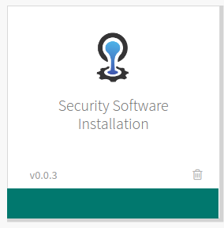
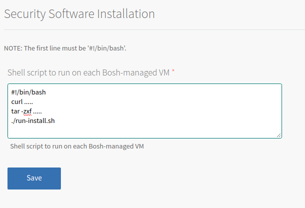

# Example PCF Tile
The purpose of this repo is to show how to buld a tile to perform pre-install actions on all Bosh-managed VMs in PCF. For example, the installation of security agents. 



This tile provides a hook for you to write simple Bash lines to perform said installation. This hook takes the form of a text box in Ops Manager that you can paste Bash code into, thus simplifying the user experience and making updates possible without the need to rebuild the tile.




We make use of the [`os_conf`](https://github.com/cloudfoundry/os-conf-release) Bosh release. We have extended the release by adding a new job, `post-deploy-script`, which causes our user-provided Bash code to run at the end of the Bosh job lifecycle. See [the Bosh doc](https://bosh.io/docs/post-deploy/) on the topic for more details. If you don't need your code to run at the end of the lifecycle and want to use this tile with newer versions of the `os_conf` release, then change your `tile.yml` to use the `pre-start-script` job instead.

This tile was generated by running `tile init` and working with the resulting `tile.yml` that it generates. 

For the latest docs on the tile generator, see https://docs.pivotal.io/tiledev/tile-generator.html.

# Customizing and Building

To build your own tile, you will need a recent copy of the `tile` binary, found on the releases page of the [tile-generator repo](https://github.com/cf-platform-eng/tile-generator).

To customize, edit the file `tile.yml`. The file is commented and will point you to where you should edit it.

Once you've customized this to suit your needs, rebuild the tile:


```
tile build
```

A successful build will look like the following:
```
$ tile build

DeprecationWarning: os_conf expected, got os-conf !!!

name: sample-agent-installation
label: Sample Agent Installation
description: Install necessary agents for compliance
version: 0.0.1
sha1: False
stemcell: ubuntu-xenial 456

download bosh release os_conf

tile generate metadata
tile generate migrations
tile generate package
include tile generator version and inputs
tile include release os-conf-21.0.0
created tile product/sample-agent-installation-0.0.1.pivotal
```

You can safely ignore the `DeprecationWarning`. This is a benign, known issue and will be fixed in future releases of the `tile` command.

Your newly-built tile can be found in the `product` directory. This is the file you will upload to Ops Manager.
